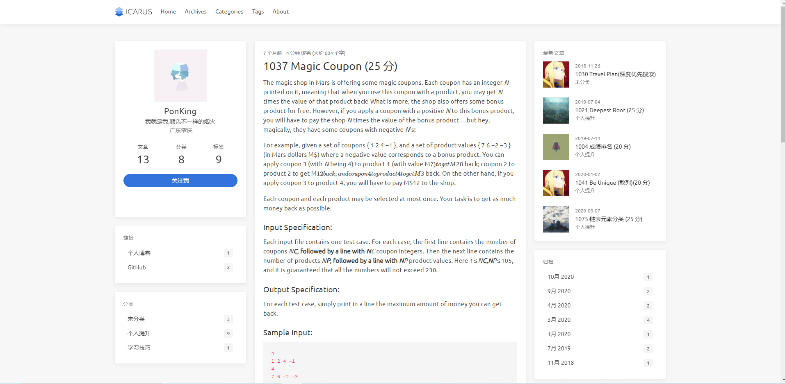
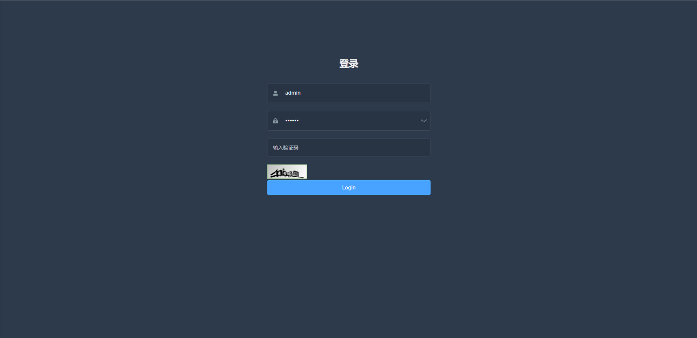

# PonkingBlog
- [前台展示链接](http://39.106.97.88:80)
- [后台展示链接](http://39.106.97.88:80) 账户：admin,密码：123456
## 前台
- [hexo-theme-icarus](https://github.com/ppoffice/hexo-theme-icarus)

## 后台
- [vue-admin-plog](https://github.com/PonKing66/vue-admin-pblog) 基于vue-admin-template

## 后端
- mysql,mybatis-plus,lombok,springboot,jwt,shiro,swagger,druid
## 其他
- maven,mysql,idea
## 更新日期
### loading
### 2020年10月4日
- 添加评论接口
- 前后端整合（vue-admin-plog整合SpringBoot）
### 2020年9月28日
- 添加PageUtil
- 统一类名
- 添加Cache缓存token,用于token注销判断
### 2020年9月2日
-  修复若干bug
-  整理前台vue
-  重写ApiArticleController
