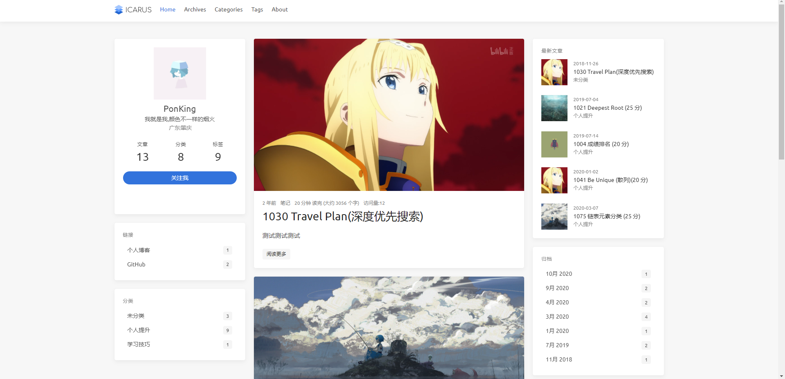
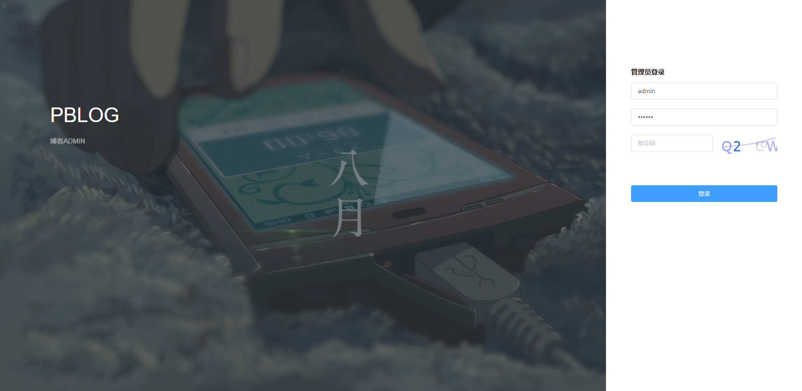
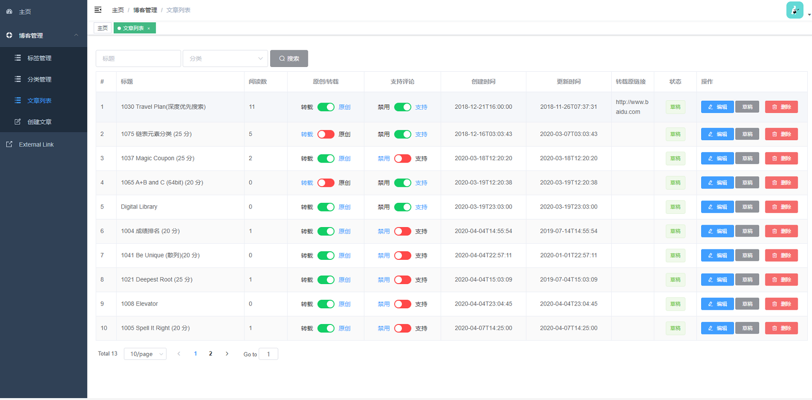

# PBlog
## 链接
- [前台展示链接](http://121.36.90.108:80) 
- [后台展示链接 （账户：admin 密码：123456）](http://121.36.90.108:80/admin/index)  
## 界面显示
### 前台
**基于[hexo-theme-icarus](https://github.com/ppoffice/hexo-theme-icarus)**


### 后台
**基于vue-admin-template**


## 技术栈
### 后端
- mysql,mybatis-plus
- lombok
- springboot
- jwt
- shiro
- swagger
- druid
- quartz
- ElasticSearch
- redis
### 前端
- vue-admin-element
- hexo-theme-icarus
- vue
### 其他
- maven,mysql,idea
## 部署
### 配置elasticSearch
```yaml
pblog:
  elasticsearch:
    host: 你的地址
    port: 你的端口
    scheme: 协议（http）

```

### 配置阿里云oss
**在表中blog_config 字段FILE_STORAGE 添加信息，格式如下**
```json
{
    "endpoint": "xxx",
    "bucket": "xxx",
    "accessKeyId": "xxx",
    "accessKeySecret": "xxx"
}
```
## 更新日志
**2020年11月12日**
-- shiro缓存失效问题
-- 登录问题
**2020年10月23日**
- 添加quartz定时任务,动态配置博客信息
- 添加Elastic服务
- 重写Cache,添加hutool缓存，重写redis

**2020年10月17日**
- 修复前台hexo样式若干问题
- 验证码插件改为 [EasyCaptcha](https://gitee.com/whvse/EasyCaptcha)

**2020年10月4日**
- 添加评论接口
- 前后端整合（vue-admin-plog整合SpringBoot）

**2020年9月28日**
- 添加PageUtil
- 统一类名
- 添加Cache缓存token,用于token注销判断

**2020年9月2日**
-  修复若干bug
-  整理前台vue
-  重写ApiArticleController
